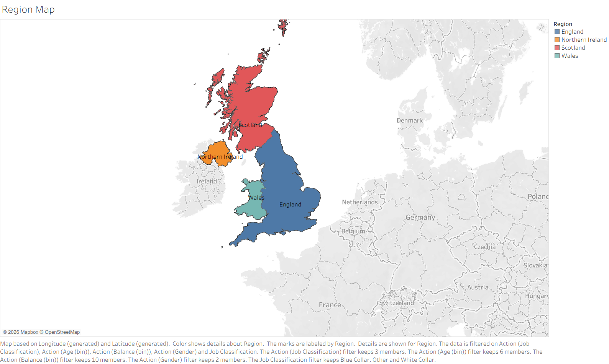
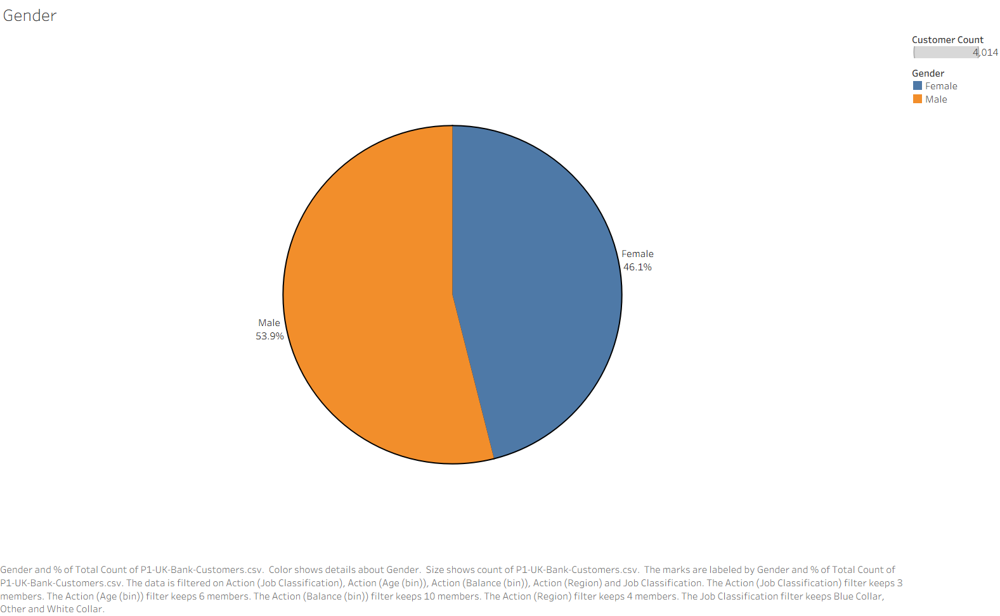
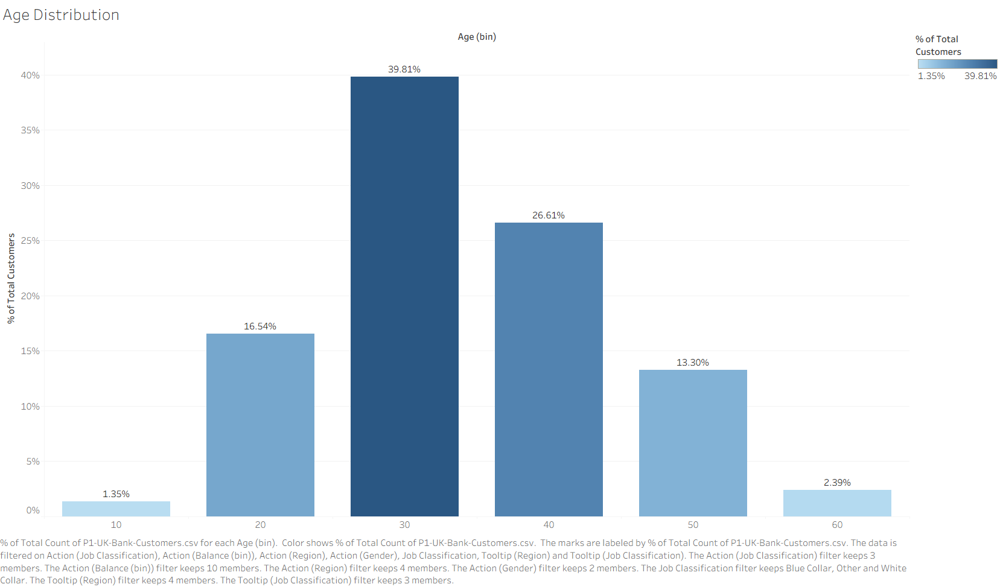
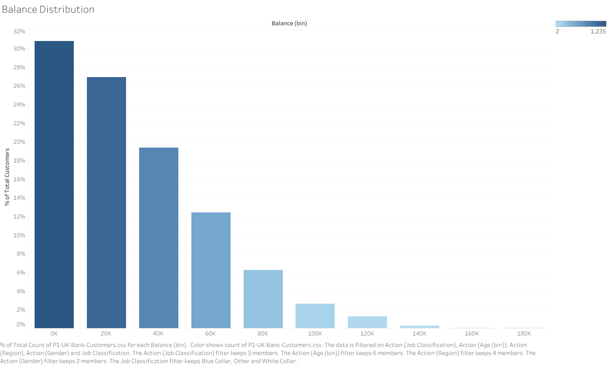
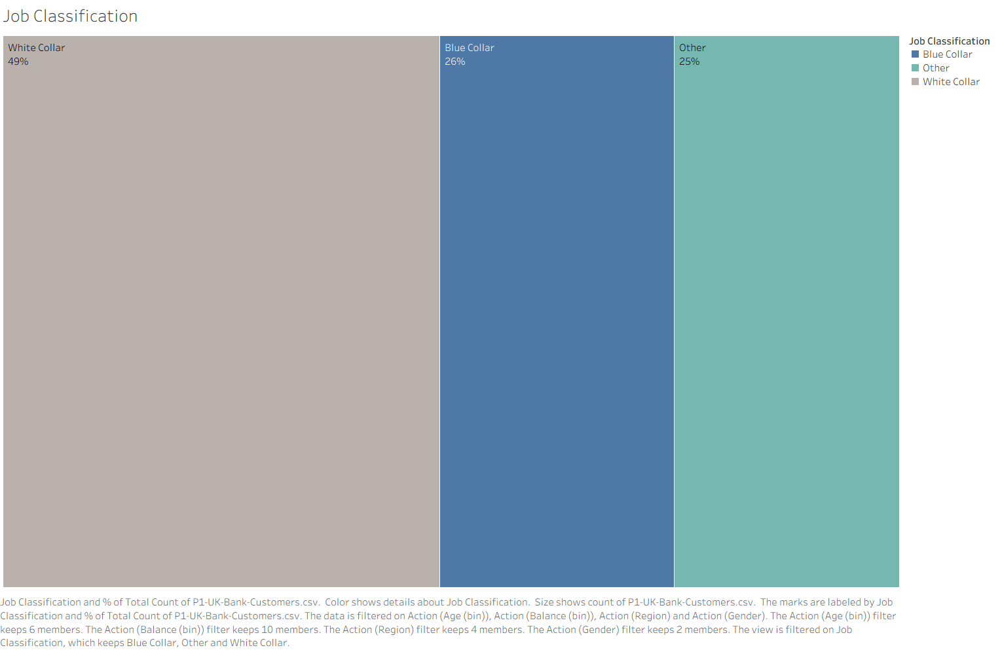
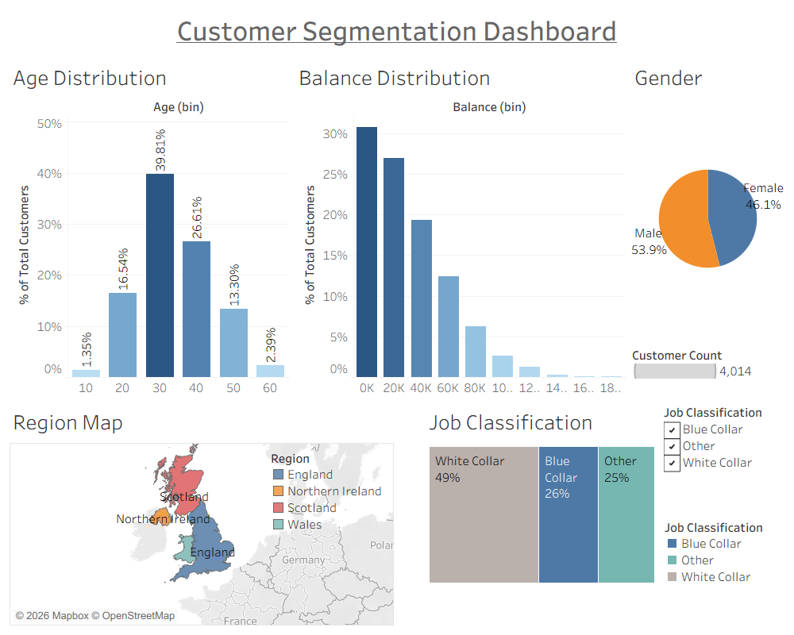
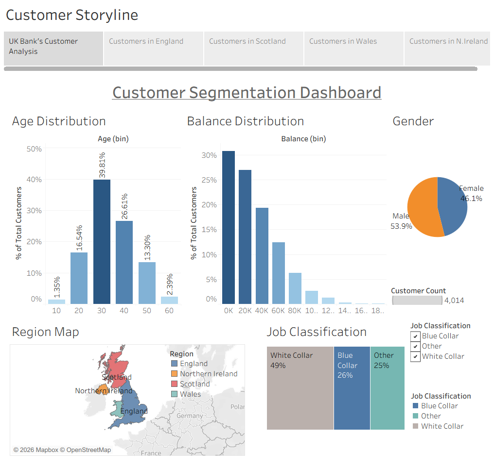

# UK Bank Customer Analysis Dashboard in Tableau

Author:

Javaria Ahmad   
Ph.D. in Computer Science (Data Science and Security)

## Project Background and Goal
This project makes use of techniques in Tableau, such as, visualiations, interactive dashboard, and storytelling to gain insights about UK bank customers' geography, demographics, and finances. The analysis takes into account these characteristics: 
- Age
- Balance
- Gender
- Job classification
- Geography
---
## Data Explained
Data Source: https://www.kaggle.com/datasets/hagarmohamed710/bank-customers   
File: P1-UK-Bank-Customers.csv   
The data has these fields:
- Customer ID
- Name
- Gender
- Age
- Region
- Job Classification
- Date Joined
- Balance

---
## Techniques

The following techniques are used for customer segmentation analysis:

- Tableau
- Analysis and visualizations for:
  - Region map
  - Age distribution
  - Balance distribution
  - Job classification
  - Gender distribution
- Dashboard
- Storytelling
- Business intelligence

---

## Approach
During the analysis, the following steps are done:
### Geographic Analysis
To study customer demographic segmentation, the geographic visual shows these areas:

- England
- Northern Ireland
- Scottland
- Wales
---
### Gender Analysis
The gender distribution pie chart shows the female versus the male population percentages.

---
### Age Analysis
The age bins help visualize the following for the customers:

- Distribution
- Most and least common groups
---
### Balance Analysis
This analysis show the following about customer balances:

- Distribution
- High and low value groups
---
### Job Classification
This analysis shows the percentages of customers in the following types of jobs:

- White collar
- Blue collar
- Other
---
## Tableau Dashboard
All the analyses from earlier steps are combined to build an interactive dashboard to show the business insights in one coherent view. The dashboard allows interactive views and filtering based on region, gender, age, balance, and job classification.

---

## Tableau Storytelling
A Tableau story depicting all the above analyses is created across customers in various regions and their segmnetation per region based on age, gender, balance, and job classification.

---

## Findings
The analysis helps draw several insight, for example, for the entire UK:

- The male customers are about 54% while the females are 46%
- The most common age value is around 30 comprising about 40% of the customer population.
- Most of the customers have low account balances with only around 5% having 80K.
- 49% of the customers hold white collar jobs while 26% have blue collar jobs.

Similarly, insights can be drawn for the indiviual regions within UK.

---

## Visualizations

### Region Map

### Gender Distribution

### Age Distribution

### Balance Distribution

### Job Classification

### Customer Segmentation Dashboard

### Customer Segmentation Storyline

---

## Repository Items
- Customer Segmentation.twbx
- README.md
- data/P1-UK-Bank-Customers.csv
- images/RegionMap.png
- images/GenderReview.png
- images/AgeDistribution.png
- images/BalanceDistribution.png
- images/JobClassification.png
- images/CustomerSegmentationDashboard.png
- images/CustomerSegmentationStoryline.png

---

